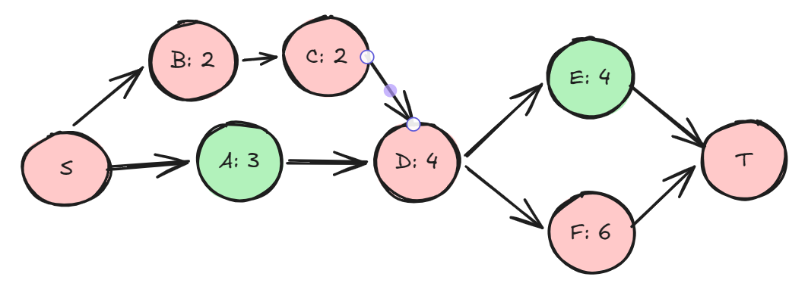

# 一文入门系统性能优化：流水线优化、计算与通信 overlap、offloading/onloading 优化

## 序

相信大家都听到过训练端 pytorch FSDP，zero 1/2/3, Deepspeed/Megatron 的 pipeline 优化、offloading 之类的， 推理端 vllm、sglang 等框架会提到 计算和通信重叠，零 cpu 开销调度（zero-overhead schedule, 当然这个有 cuda graph 巨大功劳），offloading 计算 等等。

听起来有那么一点高大上，但究其实质，就是流水线优化（streaming/pipelining），而且流水线优化的核心思路十分简单。本文将用不到 100 行核心 pytorch 代码，向大家阐述流水线优化的核心思想，展示计算和通信如何 overlap、streaming onload 的实操是什么样的。

## 流水线优化 - Streaming/pipelining

为什么我有 流水线优化 作为入门系统性能优化这一说？因为这东西太常见了，几乎从上层业务开发的模块/微服务拆分，中到网络/io/用户程序优化，下到硬件底层指令调度都能用得上。但奇怪的是，我没有看到书本或文章直接明白地阐述这一点，当然，这可能和我读书少有关系。而我个人风格也是上手就干，哪里有问题就解决哪里。所以刚毕业工作时，我其实没有系统性优化的经验，最开始只知道打时间日志，后来会用 perf/profiler 打个 timeingline trace/火焰图，找到最长的区间，然后优化它。

在工作多年后，我觉得有必要把这点提出来先给新人讲讲，什么是流水线优化。因为这实在太基础了，太贴近现实，使用得太广泛了。而学校里老师教不清，工作没人带。以至于让人无法有意识地把它主动加入系统分析中，或者自己已经用上了却不明就里。

不管那些训推框架吹得多么天花乱坠，streaming 就是很简单的东西，它的核心思想是什么？没人点明，我就大言不惭一下，streaming 的核心思想是利用异步/多线程技术，让理论上的性能瓶颈成为现实系统中的真实瓶颈，使得系统整体性能达到理论上限。

首先，肯定有人会说我这里把异步和多线程混为一谈了。当然，谁不知道异步和多线程不是一回事，但仔细想想，你说的异步确定不是靠多线程实现吗？如果说把工作留给系统内核/硬件驱动去干了，然后程序内部单线程作业，所以程序内只有异步没有多线程，那我勉强算你说得对。可深究一下，系统内核/硬件执行，那不就是另外的进程和线程吗（抱歉，不想再进一步说进程和线程的区别了，翻教科书看看吧）。真实运行环境中，99%的程序都不是单线程运行，你的程序就运行在 OS 之上，说什么单线程简直搞笑，用户程序一定会受其他进程的影响。（请写嵌入式 bootstraper 和 BIOS 的大佬略过）

其次，我为什么说 streaming 很简单？因为就像你知道做菜之前先按电饭煲烧饭（你开了一个流去烧饭，然后自己同时做菜），先按下洗衣机再去拖地（你开了一个流去洗衣服，然后自己同时拖地）一样。只要你会这些，恭喜你，你已经掌握 streaming 的用法了。

好，有点扯远了，说回后半句，什么叫 让理论上的性能瓶颈成为现实系统中的真实瓶颈？

学过数据结构、离散数学的肯定知道，在一组系统作业中（一组系统作业一般可以表现为有向无环图的形式），那整个系统的性能是由其中的关键路径决定的。

如下图，每个节点有名称和任务耗时：



什么是关键路径？就是从起点到终点累计耗时最长的那条路径，图中为 S-->B-->C-->D-->F-->T。

我们知道，在串行系统中，有依赖的任务集合，只要按拓扑顺序执行一遍即可完成所有作业。但想把系统性能优化到理论上限，你得保证关键路径上的作业前后背靠背的紧贴着执行，其他作业用单独的线程/cpu 核/硬件去执行。这样，才能让理论上的性能瓶颈成为真实的系统瓶颈。对关键路径上的任务进行更细化的算法优化之类的超出本文讨论范畴，就不说了。

最后，流水线化具体怎么实现呢？这个问题其实没有标准答案，得具体 case 具体分析。没有人可以几句话说明如何流水线化。不过，我也大概有两点总结（不一定对）

- 数据强依赖的任务放在一条流水（上一个任务的结果，就是下一个任务的输入）
- 因 cpu/gpu/device 硬件等资源占用而必须串行的，这种我称之为间接依赖的任务，可以放到不同流水线上。

真实业务系统中 DAG 状态可能会非常复杂，什么时间点发起哪一个任务的执行，如何控制数据的流向，同步点的设置等等，都要仔细分析并实现。所以前文我说那些框架吹得天花乱坠，但其实在复杂的业务系统实现流水线优化并隐藏部分开销，还是很🐂🍺的。

而复杂系统流水线化后的程序代码通常都充斥着异步回调（嵌套不知道几层，又叫回调地狱）、多线程、N 个队列传输数据，所以读起来可能十分晦涩。

因此本文将用一个十分具体且简单的场景，24 层的 MLP 模型前向推理，在几乎不影响推理速度的前提下，仅使用两层权重 buffer + 原生 pytorch 多 stream 前向推理展示，节省 75%显存占用。这个 case 涉及了 双流水线，copy 和 gpu 计算重叠，onloading（copy to device），点题了。其实我们这个场景已经表达了超大模型推理显存受限场景的一种解决方案，就是 double buffer + stream loading + 逐层计算。

## 串行 MLP 模型

本文用一个 24 层的 MLP 模型作为 baseline，线性层输入输出大小都为 8192（为了制造较大的计算负载以隐藏 copy 时延，教学演示用途）。baseline 很简单，就是初始化 model，to gpu，forward 即可（同理输入 batchsize 也用 8192）。
代码如下：

```python
import torch
import torch.nn as nn
import math

MAX_BATCH_SIZE = 8192
FEAT_DIM = 8192
NUM_LAYERS = 24
DTYPE = torch.bfloat16  # 采用 BF16

class BaseMLPModel(nn.Module):
    """base model"""

    def __init__(self, num_layers, cpu_weights, device):
        super().__init__()
        self.device = device
        self.num_layers = num_layers
        self.layers = nn.ParameterList(
            [nn.Parameter(w.clone().detach().to(self.device)) for w in cpu_weights]
        )

    def forward(self, x):
        for layer in self.layers:
            x = x @ layer
        return x

@torch.inference_mode()
def benchmark():
    device = torch.device("cuda:0")

    x = torch.randn(8192, 8192, dtype=DTYPE, device=device)

    # Xavier 初始化，防止多层叠乘数值爆炸
    scale = 1.0 / math.sqrt(8192)
    pinned_cpu_weights = [
        (torch.randn(8192, 8192, dtype=DTYPE) * scale).pin_memory()
        for _ in range(NUM_LAYERS)
    ]

    model_base = BaseMLPModel(NUM_LAYERS, pinned_cpu_weights, device)

    # warmup
    for _ in range(2):
        out_std = model_base(x)
   
    iters = 5
    start = torch.cuda.Event(enable_timing=True)
    end = torch.cuda.Event(enable_timing=True)

    # 1. base model
    torch.cuda.empty_cache()
    torch.cuda.reset_peak_memory_stats(device)
    start.record()
    for _ in range(iters):
        out_std = model_base(x)
    end.record()
    torch.cuda.synchronize()
    std_time = start.elapsed_time(end) / iters
    std_mem = torch.cuda.max_memory_allocated(device) / (1024**2)
```

## 双 buffer streaming onload layer 推理

现在的 gpu 是支持 host->device、compute、device->host 三种操作并行，相同操作之间只能串行。

那么显而易见，在我们这个场景，只需要将 layer 权重搬运到 gpu，然后计算，再搬运+计算，划为两条流水线（两层 layer 的 copy+计算）后，在时间序列下，可以放置为下图的样子：

```yaml
时间轴：t0 ----> t1 ----> t2 ----> t3 ----> t4 ---->
Copy 流：[Layer0] [Layer1] [Layer2] [Layer3] ...
计算流：[Layer0] [Layer1] [Layer2] ...
```

时间开销：做到了 不同 layer 之间的权重 copy 和计算的重叠，减少了 min（copy，compute）的时间开销，节省下的时间就是被流水线隐藏的时延。
空间开销：特别的，要做到 copy 和计算重叠，那么显然他们操作就不能是同一块显存 buffer，因此两条流水线需要双 buffer，N 条流水线需要 N buffer（多 buffer 还有个响亮的名字叫 ring buffer）

更具体一点，利用 pytorch 提供的 cuda stream，我们可以实现双 buffer 双流水线逐层计算，流程如下：

- prologue： 在 copy stream 上 先 load 第 0 层权重到 buffer_read，记录事件回调
- main loop：
  - copy stream
    - 当层数大于 0 时，要接力 compute stream 的事件回调
    - 然后继续在 copy stream 上 copy 加载下一层权重到 buffer_write，记录事件回调
  - compute stream 接力 copy stream 的 上一次事件回调，然后计算，计算完记录事件回调
  - 交换读写 buffer idx
- epilogue：
  - 结果 copy 回 host
得益于 PyTorch 的流管理机制，本层的输出在计算流（compute stream）上完成，外部调用若使用默认流可安全消费。但在复杂拓扑中，务必注意跨流张量的显式同步。

代码如下：

```python
class DualStreamModel(nn.Module):
    """double buffer, double stream"""

    def __init__(self, num_layers, cpu_weights, device):
        super().__init__()
        self.num_layers = num_layers
        self.device = device

        self.cpu_weights = cpu_weights

        self.weight_buffers = [
            torch.empty((FEAT_DIM, FEAT_DIM), dtype=DTYPE, device=self.device),
            torch.empty((FEAT_DIM, FEAT_DIM), dtype=DTYPE, device=self.device),
        ]

        # copy stream, two events
        self.copy_stream = torch.cuda.Stream(device=self.device)
        self.events_copy_done = [torch.cuda.Event(), torch.cuda.Event()]
        self.event_compute_done = [torch.cuda.Event(), torch.cuda.Event()]

    def forward(self, x):
        compute_stream = torch.cuda.current_stream(self.device)

        # --- prologue ---
        with torch.cuda.stream(self.copy_stream):
            self.weight_buffers[0].copy_(self.cpu_weights[0], non_blocking=True)
            self.events_copy_done[0].record(self.copy_stream)
        read_idx, write_idx = 0, 1

        # --- main loop ---
        for i in range(self.num_layers):

            # 1. 【后台】异步预取下一层 i+1 到 write_idx buffer
            if i + 1 < self.num_layers:
                if i >= 1:
                    self.copy_stream.wait_event(self.event_compute_done[write_idx])

                with torch.cuda.stream(self.copy_stream):
                    self.weight_buffers[write_idx].copy_(
                        self.cpu_weights[i + 1], non_blocking=True
                    )
                    self.events_copy_done[write_idx].record(self.copy_stream)

            # 2. 【前台】等待当前 buffer copy 完毕并就地计算
            compute_stream.wait_event(self.events_copy_done[read_idx])
            x = x @ self.weight_buffers[read_idx]
            self.event_compute_done[read_idx].record(compute_stream)

            # 交换 buffer
            read_idx ^= 1
            write_idx ^= 1

        return x

@torch.inference_mode()
def benchmark():
    device = torch.device("cuda:0")

    x = torch.randn(8192, 8192, dtype=DTYPE, device=device)

    # Xavier 初始化，防止多层叠乘数值爆炸
    scale = 1.0 / math.sqrt(8192)
    # 注意：Host 端的 Tensor 必须使用 pin_memory() 锁页，配合 non_blocking=True 才能真正让 Copy 操作在后台流中异步执行，否则会退化为阻塞的同步传输
    pinned_cpu_weights = [
        (torch.randn(8192, 8192, dtype=DTYPE) * scale).pin_memory()
        for _ in range(NUM_LAYERS)
    ]

    model_base = BaseMLPModel(NUM_LAYERS, pinned_cpu_weights, device)
    model_stream = DualStreamModel(NUM_LAYERS, pinned_cpu_weights, device)

    # warmup
    for _ in range(2):
        out_std = model_base(x)
        out_stream = model_stream(x)
    torch.cuda.synchronize()

    iters = 5
    start = torch.cuda.Event(enable_timing=True)
    end = torch.cuda.Event(enable_timing=True)

    # 1. base model
    torch.cuda.empty_cache()
    torch.cuda.reset_peak_memory_stats(device)
    start.record()
    for _ in range(iters):
        out_std = model_base(x)
    end.record()
    torch.cuda.synchronize()
    std_time = start.elapsed_time(end) / iters
    std_mem = torch.cuda.max_memory_allocated(device) / (1024**2)

    # 2. double stream model
    del model_base
    torch.cuda.empty_cache()
    torch.cuda.reset_peak_memory_stats(device)
    start.record()
    for _ in range(iters):
        out_stream = model_stream(x)
    end.record()
    torch.cuda.synchronize()
    off_time = start.elapsed_time(end) / iters
    off_mem = torch.cuda.max_memory_allocated(device) / (1024**2)

    assert torch.allclose(out_std, out_stream, rtol=1e-2, atol=1e-2), "diff error"
```

## benchmark 输出

测试环境为 5060 laptop，因为算力特别低，我特意选取的 data shape 使得计算开销几乎完美隐藏了 copy 开销：

```yaml
=== 24 层网络 BF16 极限压测报告 (Batch: 8192) ===
----------------------------------------------------------------------------------------
评估维度                 | BaseModel （全量驻留） | Streaming Onload （双缓冲） | 对比差值 / 收益
----------------------------------------------------------------------------------------
单次推理耗时 (ms)      |        1101.41 |        1108.22 | 性能保持率：99.39%
峰值显存占用 (MB)      |        3976.12 |         904.12 | 降低占比：77.26%
----------------------------------------------------------------------------------------
 -> 绝对收益：仅牺牲了 0.61% 的计算耗时，换取了 3072.00 MB 的物理显存空间。
```

## 总结

- 我们使用 pytorch cuda stream 完成了一个 double buffer + double stream 的 计算 和 copy overlap 前向推理
  - 在几乎不损失推理性能的前提下，减少了 75% 空间占用。
- 这个 case 是我凑出来用来演示了多级流水线的空间复杂度优化能力的。在真实业务场景中，流水线本身就是优化时延开销利器（因为并行了嘛），但具体场景需要具体分析
  - 特别的，此 case 没有涉及 offloading，如大语言模型推理中对产生的 kv cache 进行 streaming offload/onload 取用是很常见的 case，但思路类似。

我记得之前部署 wan2.2 I2V pipeline，它会按高低噪声时间步用不同的 dit（就是 diffusion step 中间会切换一次模型），两个模型权重+视频激活值巨大，双卡 h20 都没法同时放下两个模型，所以官方 demo 也是给的 FSDP 推理实现。

希望这个 case 能给大家一点收获

如有错误，欢迎指正，感谢阅读！

以上

完整代码和测试脚本见 github [vitamin-cuda](https://github.com/WingEdge777/vitamin-cuda/tree/main/infer/torch/overlap_infer)
