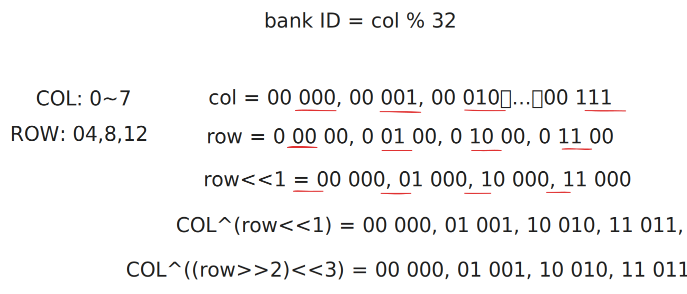
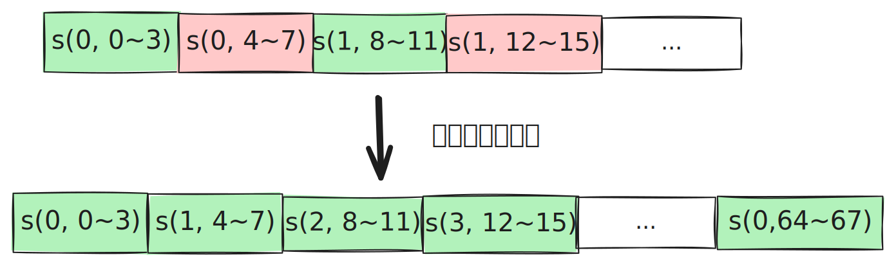
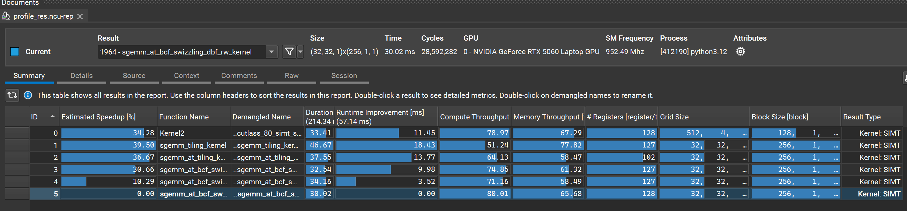

# [CUDA 优化实战] sgemm tf32 - 超越 cuBLAS：Tensor-core、cp.async、ldmatrix、mma

## 0. 序 - 向量化计算的时代

（干货核能预警，配图较多，涉及大量地址坐标映射推导代码，建议在 PC 端阅读以获得最佳体验）
（本文适用于有一定 CUDA 编程基础，熟悉 GEMM simt 优化，对进阶 tensor core / 嵌入 PTX 指令 性能调优感兴趣的读者阅读）
（所有 kernel 完整代码可以从 github 获取：）
>
> 怎么感觉要写出超越 cuBLAS 系列合集呢
>
在如今 Tensor Core 满天飞的时代，要是你还不知道怎么用 Tensor Core 进行 GEMM 计算，那你可能已经落后于时代了。

本文以 M=N=K=4096（MxKxN, 这是 cuBLAS 最擅长的中等规模）的GEMM tf32为例，在 RTX 5060 移动版显卡上，本人将使用 cp.async、ldmatrix、mma 等 PTX 指令，使用 Tensor-Core TF32加速  计算，在同精度赛道上成功超越了 NVIDIA 原厂的 cuBLAS。本文将复盘这场与 cuBLAS 较量（真较量，ncu 一步一步profile+迭代优化）过程。细节会具体到 cp.async 指令的运用，ldmatrix/mma warp 级别 PTX 指令，

本文会给出 5 个 kernel 实现，从基础的 cp.async + 双 ldmatrix + mma，到 swizzle 解决 bank conflict，分析 ldmatrix/mma 的 b fragments layout 从而直接使用 shared load 更进一步解决 bank conflict，使用 grid swizzling 复用 L2，double buffer 隐藏时延 等手段完成最终对 cuBLAS 的超越。整个过程涉及对指令需求用法的介绍和分析，精巧的 swizzle 设计，隐藏时延的哲学，希望能帮助读者深入理解 Tensor Core 的使用和优化技巧。

和之前 sgemm simt kernel 相比，本人是先有的优化路径然后写代码，但由于本人对 tensor core 也并不熟悉，这一次是 ncu profile 驱动型演进。并且我先 profile 了 cuBLAS 的实现，从他的 kernel 名字和 shared memory table 逆推+参考其优化策略，最终实现了性能超越。（本人有合理理由怀疑 cuBLAS 应该是很久未更新，或者说未针对消费级显卡进行优化，因为本人在还有优化策略没全部用上的时候就已经匹配上了 cuBLAS 的性能）

kernel 大纲如下（第一个是 cublas kernel）

- sgemm_cublas tf32 版
- sgemm_tf32_bt（向量化读 A/B，B 转置写入 smem, ldmatrix + mma）
- sgemm_tf32_bt_swizzle （向量化读 A/B，B 转置写入 smem, ldmatrix + mma, As 0 冲突）
- sgemm_tf32_bt_swizzle_dbf （向量化读 A/B，B 转置写入 smem, ldmatrix + mma, As 0 冲突，grid swizzling, 97~102% cuBLAS 性能）
- sgemm_tf32_swizzle_bcf (cp.async 读写 A/B，swizzle， As/Bs 无冲突，grid swizzling)
- sgemm_tf32_swizzle_bcf_dbf (cp.async 读写 A/B，swizzle， As/Bs 无冲突，grid swizzling，双 buffer，超越 cuBLAS)

## 0x0. PTX 指令 && ncu profile cublas kernel

当我准备开始写 sgemm tf32 kernel 时，先去搜索了下 ldmatrix、mma 指令相关的博客文章想好好学一下。等大概翻了下发现，怎么都是讲的半精度的 GEMM（倒也合理，毕竟是 Tensor Core 最初就是为半精度设计的），但是难道大家从半精度开始学起的，就不管 tf32 了（我丢）。无奈，只好自己开始翻 nvidia 的 PTX 文档，以及先 profile 一下 cublas kernel 作为参考。

### PTX 指令

PTX（parallel-thread-execution）官方文档：<https://docs.nvidia.com/cuda/parallel-thread-execution/index.html>，是 nv 提供的虚拟汇编指令语法集。在本文中主要用到的指令有：cp.async、ldmatrix、mma，cp.async 是异步拷贝指令，ldmatrix/mma 是 warp 级别协同搬运计算指令。具体如下：

- cp.async：异步拷贝指令，支持bypass L1/register， 从gmem直达 smem，节省大量寄存器资源，并且异步性非常适合与计算重叠作为多级流水线实现的基础
- mma：说 ldmatrix 之前要先说 mma，因为 ldmatrix 就是为 mma 服务的
- ldmatrix：一个 warp 从 smem 协同加载一个小矩阵分块（fragment，）

### cuBLAS kernel ncu report

说实话，第一眼看到cuBLAS的 ncu report时，我是有点发虚的。根据shared memory table显示，它使用了cp.async，ldmatrix，shared load，但是 0个 shared memory bank conflict，平衡的compute 和 memory throughput，全合并的global memory访问。看起来似乎没有优化空间了，这如何match上它的性能啊，所以最初想着能达到95%性能以上就差不多了。

再看一眼kernel名字，还是调用的cutlass kernel `void cutlass::Kernel2<cutlass_80_tensorop_s1688gemm_64x256_16x4_nn_align4>(T1::Params)`, 嗯，tensor core mma m16n8k8，,4x256的tiling（m=64，n=256），16的k维度切块，4级流水线。

## 0x1. sgemm_tf32_bt
这个初版kernel，我的想法很简单，就是把cp.async用上，ldmatrix + mma启动起来，就算成功。其他bankconflict，合并访存什么的就先不管了。当然，也没有那么粗暴。虽然大概猜出cublas是用的cutlass的实现，但是我并不想照抄他的，抄，抄还能超得过师傅吗，何况逆推的策略也不一定完整，起码4级流水线我就不想写（要改smem大小），然后调度4个stage，放弃。

我还是按我原来SIMT kernel 的思路，128x128的tiling，256的thread block（选择这两的策略，详细情况见我上一篇文章）
然后也没有太多要点，As矩阵用cp.async bypass L1直达 smem，Bs 矩阵用 LDG + 手动转置写入smem。然后用 ldmatrix 加载到寄存器，然后 mma 计算。

```cpp

```

注释里其实已经说得比较详细了，但这里我们再强调几个关键点：

- 搬运 a 数据块 128x16 和 b 数据块 16x128 就是粗暴的平铺线程，相邻线程跨列为 4，float4 向量化读取，相邻线程尽量读取连续地址合并访问
  - 每 4 个线程搬运 a 的一行，每 32 线程搬运 b 的一行
- 在分配计算 c 行列时，我先简单做了一个 2d warp tiling，每 4 个 warp 各负责上下两半 64x128 的 c，起初是觉得尽量均匀对称连续的分配行列比较好，然后每个线程各取连续的 8 行 a、8 列 b 进行累加乘积和
- 最后 c 写回，由于上一步取的是连续的列，所以也可以放心用 float4

## 3. at_tiling

初版的 kernel 有个明显的优化点，那就是在内层循环读取 As smem 时，用了循环标量读取，这给 LSU 带来了很大的指令压力，而且在计算循环中频繁的等待数据是很糟糕的选择，会产生很多小空泡。因此可以立马想到的一个优化点就是将 a 矩阵转置后存入 smem，这样读取时就能用 float4 等向量读取，提高指令级并行度。虽然这样导致写入时被迫以标量写入，但内层循环的读取压力大大降低，用用外层循环的 “2 个 float4 拆成 8 个标量写入” 来换取内层计算循环的 “16x8 次标量读取优化为 16x2 次 float4 读取” 这种 trade-off 是值得的，因为能显著降低 LSU 的压力，避免 ALU 计算单元在计算过程中等待 L1 数据，提高整体吞吐。

核心修改非常简单，就是交换一下 a 的行列，如下：

```cpp
template <const int BM = 128, const int BN = 128, const int BK = 16, const int TM = 8, const int TN = 8>
__global__ void sgemm_at_tiling_kernel(float *a, float *b, float *c, int m, int n, int k) {
    // 不变
    ...
    __shared__ float As_T[BK][BM]; // a 转置
    __shared__ float Bs[BK][BN];

    for (int bk = 0; bk < k; bk += BK) {
        // A 矩阵转置标量写入共享内存
        float4 tmp_a0 = FLOAT4(a[(by * BM + load_a_row) * k + bk + load_a_col]);
        As_T[load_a_col + 0][load_a_row] = tmp_a0.x;
        As_T[load_a_col + 1][load_a_row] = tmp_a0.y;
        As_T[load_a_col + 2][load_a_row] = tmp_a0.z;
        As_T[load_a_col + 3][load_a_row] = tmp_a0.w;

        float4 tmp_a1 = FLOAT4(a[(by * BM + load_a_row + 64) * k + bk + load_a_col]);
        As_T[load_a_col + 0][load_a_row + 64] = tmp_a1.x;
        As_T[load_a_col + 1][load_a_row + 64] = tmp_a1.y;
        As_T[load_a_col + 2][load_a_row + 64] = tmp_a1.z;
        As_T[load_a_col + 3][load_a_row + 64] = tmp_a1.w;

        ...

        // 8x8 循环计算累加乘积和
#pragma unroll
        for (int i = 0; i < BK; i++) {
            float reg_a[TM], reg_b[TN];
            // float4 读取
            FLOAT4(reg_a[0]) = FLOAT4(As_T[i][c_row]);
            FLOAT4(reg_a[4]) = FLOAT4(As_T[i][c_row + 4]);
            // 其他不变
            ...
        }
        ...
    }
    ...
}
```

## 4. at_tiling + swizzling

上一版代码虽然通过转置 As 矩阵提高了内层循环读取效率，但是也引入了一个新的问题：shared memory bank conflict。在标量写入 smem 时，发生了 4-way bank conflict。原因就在于

```cpp
    int load_a_row = tid / 4;               // 0~63
    int load_a_col = (tid % 4) * 4;         // 0,4,8,12...
    ...
    As_T[load_a_col + 0][load_a_row] = tmp_a0.x; // 4-way bank conflict
```

为什么会冲突？首先直观看待一下 As_T[16][128]， 一行 128 个数据，所以行号不影响 bank id（bank id = (row*128 + col) % 32）, 而搬运 a 数据时为了合并访问线程是平铺的，导致在转置写入 smem 时，单个 warp 内相邻线程对应的坐标行列号变为了（以 warp 0 为例）

```yaml
col : 0, 0, 0, 0, 1, 1, 1, 1...
row : 0, 4, 8, 12, 0, 4, 8, 12...
```

典型的 4-way bank conflict，每四个线程同时访问同一 bank 的不同地址。这里我们使用一个稍微复杂一点的 swizzle 技巧来避免 bank conflict。我们需要找到一种映射 f(row, col) -> (row, new_col) 使得 new_col 分散在 32 个 bank 内。

在之前矩阵转置的文章提到了一种简单 XOR swizzle 的方法：`new_col = row^col` 这里没法直接用，为啥？因为这里的 col 和 row 都没有遍历一组 32 个 bank 的所有可能值，直接使用 row 的 bit 去扰动 col，并不能达到目的。

好，我们现在开始推导新的 swizzle 公式。首先牢记一个物理限制：Bank ID 只由坐标的低 5 bits 决定（因为 % 32）。



通过仔细观察，一个 warp 内，以 warp 0 为例：

- row（即代码中的 load_a_col）的值是 0，4，8，12，... ，其二进制表示的变量位在 bit 2 和 bit 3（00000, 00100, 01000, 01100...）。
- 而 col（即代码中的 load_a_row）取值是 0~7，其二进制的变量位在 bit0~bit2（00000 ~ 00111）。

很自然的，既然冲突是相同的 col 导致的，而他们的 row 值都不同。那我们可以把 row 左移一位，变成 0, 8, 16, 24，这样它的变量位就推到了 bit3 和 bit4。此时再把它和 col 做 XOR，神奇的事情就发生了：row 负责填满高 2 位（bit 3, 4），col 负责填满低 3 位（bit 0~2），两者交错异或，相当于完美铺满并遍历了低 5 bits 的所有 32 种情况！

其他 warp 情况是类似的，比如 warp 1 的 col 为 01xxx， 只要去异或 bit4~5 的四种排列，就能得到互不相同的 32 个值，这是 xor 的双射性质保证的；而单个 warp 内 的 row，每次都是同步变动，比如在 row 变为 1，5，9，13 时， 二进制为 xx01，左移 1 位后变化位依然是 bit4~5，同理依然能得到互不相同的 32 个值

由此，我们得到一个写入 As_T 无冲突的 swizzle 映射：`new_col = col^(row << 1)`

但这还不够，虽然乱序写入完美打散了 Bank，但我们在内层循环还需要用 float4 向量化读取，float4 的物理底线是：这 4 个连续的 float 不仅要在物理内存上挨在一起，且起始地址必须 16 字节对齐。同时我们注意到，在`FLOAT4(reg_a[0]) = FLOAT4(As_T[i][SWIZZLE_A(i, c_row)]);`这个读取动作中，32 个线程的外层 row 维坐标（变量 i）是固定不变的！

怎么做？col 下标的二进制的低 2bits 决定了 4 float 的一个 segment，只需要把 row 的低 2bits 都抹为 0，`00 xor (col's bit0~1) = col's bit0~1`，就不会改变 `col+0,col+1,col+2,col+3` 4 个元素之间的相对顺序。这，其实就是 float4 数据打包的地址 swizzle 映射：`new_col = col^((row>>2) << 3)`。

这个映射确保了 row 的扰动有效位始终是 bit4~5 (>>2 把低 bit0~1 都抹掉了，当 i 遍历 0，1，2，3 时，(i>>2) << 3 值都为 0；当 i 遍历 4,5,6,7 时，(i>>2) << 3 值都为 8，以此类推）

最终核心修改：

```cpp
#define SWIZZLE_A(x, y) ((y) ^ ((x >> 2) << 3))

template <const int BM = 128, const int BN = 128, const int BK = 16, const int TM = 8, const int TN = 8>
__global__ void sgemm_at_bcf_swizzling_kernel(float *a, float *b, float *c, int m, int n, int k) {
    // 不变
    ...
    for (int bk = 0; bk < k; bk += BK) {
        // A 矩阵转置并 swizzling 写入共享内存
        float4 tmp_a0 = FLOAT4(a[(by * BM + load_a_row) * k + bk + load_a_col]);
        As_T[load_a_col + 0][SWIZZLE_A(load_a_col + 0, load_a_row)] = tmp_a0.x;
        As_T[load_a_col + 1][SWIZZLE_A(load_a_col + 1, load_a_row)] = tmp_a0.y;
        As_T[load_a_col + 2][SWIZZLE_A(load_a_col + 2, load_a_row)] = tmp_a0.z;
        As_T[load_a_col + 3][SWIZZLE_A(load_a_col + 3, load_a_row)] = tmp_a0.w;

        float4 tmp_a1 = FLOAT4(a[(by * BM + load_a_row + 64) * k + bk + load_a_col]);
        As_T[load_a_col + 0][SWIZZLE_A(load_a_col + 0, load_a_row + 64)] = tmp_a1.x;
        As_T[load_a_col + 1][SWIZZLE_A(load_a_col + 1, load_a_row + 64)] = tmp_a1.y;
        As_T[load_a_col + 2][SWIZZLE_A(load_a_col + 2, load_a_row + 64)] = tmp_a1.z;
        As_T[load_a_col + 3][SWIZZLE_A(load_a_col + 3, load_a_row + 64)] = tmp_a1.w;

        ...

        // 8x8 循环计算累加乘积和
#pragma unroll
        for (int i = 0; i < BK; i++) {
            // swizzle 读取
            FLOAT4(reg_a[0]) = FLOAT4(As_T[i][SWIZZLE_A(i, c_row)]);
            FLOAT4(reg_a[4]) = FLOAT4(As_T[i][SWIZZLE_A(i, c_row + 4)]);

            ...
        }
        __syncthreads();
    }
}
```

全面的 swizzle 机制其实可以单开一篇文章详细写写。但在此要重点说明一下，swizzle 的具体公式是要依据数据类型和 data layout 推导出来的（cutlass 的 swizzle 模板也只能用于几种特定的 data + layout）。只要理解 xor 的性质，推导 xor swizzle 公式并不难，使用起 swizzle 模板也更得心应手。

## 5. at_tiling + swizzling + 全合并读写 global memory

上一版作为单 buffer 无流水线的 kernel 已经比较可以了，但还有点瑕疵，使用 ncu profile 后查看发现有

- 非合并写 global memory 的访存写入，提示如下

```yaml
1、
The memory access pattern for global stores to L1TEX might not be optimal. On average, only 16.0 of the 32 bytes transmitted per sector are utilized by each thread. This could possibly be caused by a stride between threads. Check the  Source Counters section for uncoalesced global stores.

2、
This kernel has uncoalesced global accesses resulting in a total of 2097152 excessive sectors (2% of the total 138412032 sectors). Check the L2 Theoretical Sectors Global Excessive table for the primary source locations. The  CUDA Programming Guide has additional information on reducing uncoalesced device memory accesses.
```

为什么 ncu 会出现这两个提示，原因是在单个线程计算 8 行 8 列时，我们选择了连续的 8 列，这导致在写回 c 矩阵 时需要分两次 float4 写出，如果看一个 warp 相邻线程的情况就是，都隔着空泡 (4 个 float) 在写数据，而 L1/L2 的访问模式都是按一个 128bytes 作为内存事务进行的，我们分两次写出，其实都发起了两批完全一模一样的内存事务请求，只不过第一次写了其中 64bytes，第二次写了另外 64bytes，这造成了显著浪费。

两个异常提示是同一个问题在 L1 和 L2 两个层面的体现，为了解决这个问题。我们可以重新设计一下每个线程负责的 8 列，只要把这 8 列分成两个连续的 4 列，依然可以用 float4 读写，同时把相邻线程划到连续的 float4 地址上，比如 T0 读取 0~3，T1 读取 4~7..., 读完一次 float4 后， T0 再读 64~67，T1 读取 68~71... 这样就能保证写回 c 时相邻线程地址是合并的了。



核心修改如下，把 2d warp tiling 去掉，一个 warp 负责 16 行 c，然后直接用线程 id 去映射成我们想要的 c_col。

```cpp
    // warp tiling
    // 线程在 Warp 内的行偏移依然是 0 或 8
    int t_row_in_warp = (lane_id / 16) * 8;

    // 每个 Warp 只负责 16 行，每 16 线程负责 8 行 128 列，每行 128 个元素，列维度分两次 load + 计算
    // 每个线程 一次 load 8 行 8 列，但是 8 列拆开为跨越 64 列的两次 float4, 比如 T0 负责读写 0~3,64~67 8 列，
    // 这样每 8 个线程在写回 c 的时候是连续的 32 个 float,128bytes, 完美事务合并
    int c_row = warp_id * 16 + t_row_in_warp;
    int c_col_base = (lane_id % 16) * 4;
    int c_col_0 = c_col_base;      // 0~3
    int c_col_1 = c_col_base + 64; // 64~67

    ...

    FLOAT4(reg_b[0]) = FLOAT4(Bs[i][c_col_0]); // 读 0~3
    FLOAT4(reg_b[4]) = FLOAT4(Bs[i][c_col_1]); // 读 64~67
```

## 6. at_tiling + swizzling + 全合并读写 global memory + 双 smem buffer

上一个 kernel 写完，其实基本达到单 buffer kernel 的天花板了，完美的合并读写（global memory，smem）, 充分的访存算力比。还想进一步提高上限，要开始上特殊技巧了，那就是 copy 和 compute overlap，这是高性能计算老生常谈的话题了。CUDA LSU 发起内存事务请求，从 global memory 加载数据到寄存器（其实是要过 L2-->L1-->register）, ALU 可以说是没事干，即使有多个 block/warp 在切换计算，但还是不如在一个 warp 内利用空闲时间做计算来得高效（进一步提高指令级并行度，隐藏访问时延）。这里实现的方式是传统的 double buffering, 不使用 cp.async 等新架构特性。

流水线算法流程：

- 预先加载一块 a/b 到 smem_buffer[0]，同步`__syncthreads()`确保写入 smem 完成
- 循环主体：
  - 先发起请求加载下一块 a/b 到 寄存器，
  - 然后立刻拿 smem_buffer[0] 中的数据计算（和上一步 overlap）
  - 计算完后，再将循环开头加载到寄存器的数据，写入到 smem_buffer[1]，同步`__syncthreads()`
    - 对比单 buffer kernel，可以发现，循环主体少了一次同步开销（其实就是空间换时间）
  - 交换 smem_buffer 指针，开始下一循环
- 收尾阶段
  - 循环结束，计算最后一次 load 的数据块
  - 将累加寄存器 sum[8][8] 写回 c 矩阵的 global memory，算法结束

最后贴一个最终版本的完整 kernel 代码：

```cpp

template <const int BM = 128, const int BN = 128, const int BK = 16, const int TM = 8, const int TN = 8>
__global__ void sgemm_at_bcf_swizzling_dbf_rw_kernel(float *a, float *b, float *c, int m, int n, int k) {
    int bx = blockIdx.x, by = blockIdx.y;
    int tid = threadIdx.x; // 0~255; 8 个 warp
    int warp_id = tid / WARP_SIZE;
    int lane_id = tid % WARP_SIZE;

    // 搬运映射
    int load_a_row = tid / 4;               // 0~63
    int load_a_col = (tid % 4) * 4;         // 0,4,8,12...
    int load_b_row = tid / WARP_SIZE;       // 0~8
    int load_b_col = (tid % WARP_SIZE) * 4; // 0,4,8,12,16,20,24,28...

    // c 计算读写数据映射，和之前相同
    int t_row_in_warp = (lane_id / 16) * 8;
    int c_row = warp_id * 16 + t_row_in_warp;
    int c_col_base = (lane_id % 16) * 4;
    int c_col_0 = c_col_base; // 0~3
    // int c_col_1 = c_col_base + 64; // 64~67 减少变量，压低寄存器用量

    // double buffer
    __shared__ float As_T[2][BK][BM];
    __shared__ float Bs[2][BK][BN];

    float sum[TM][TN] = {0.f};

    // 维护显存读取的一维扁平指针，方便在流水线中步进
    float *a_ptr = a + (by * BM + load_a_row) * k + load_a_col;
    // float *a_ptr_64 = a + (by * BM + load_a_row + 64) * k + load_a_col;
    float *b_ptr = b + load_b_row * n + bx * BN + load_b_col;
    // float *b_ptr_8 = b + (load_b_row + 8) * n + bx * BN + load_b_col;

    // 先加载第一块，多消耗 16 个寄存器，上面几个注释掉将寄存器数量压低于 128 个，保障 Occupancy 不变
    float4 tmp_a0 = FLOAT4(a_ptr[0]);
    float4 tmp_a1 = FLOAT4(a_ptr[64 * k]);
    float4 tmp_b0 = FLOAT4(b_ptr[0]);
    float4 tmp_b1 = FLOAT4(b_ptr[8 * n]);

    As_T[0][load_a_col + 0][SWIZZLE_A(load_a_col + 0, load_a_row)] = tmp_a0.x;
    As_T[0][load_a_col + 1][SWIZZLE_A(load_a_col + 1, load_a_row)] = tmp_a0.y;
    As_T[0][load_a_col + 2][SWIZZLE_A(load_a_col + 2, load_a_row)] = tmp_a0.z;
    As_T[0][load_a_col + 3][SWIZZLE_A(load_a_col + 3, load_a_row)] = tmp_a0.w;

    As_T[0][load_a_col + 0][SWIZZLE_A(load_a_col + 0, load_a_row + 64)] = tmp_a1.x;
    As_T[0][load_a_col + 1][SWIZZLE_A(load_a_col + 1, load_a_row + 64)] = tmp_a1.y;
    As_T[0][load_a_col + 2][SWIZZLE_A(load_a_col + 2, load_a_row + 64)] = tmp_a1.z;
    As_T[0][load_a_col + 3][SWIZZLE_A(load_a_col + 3, load_a_row + 64)] = tmp_a1.w;

    FLOAT4(Bs[0][load_b_row][load_b_col]) = tmp_b0;
    FLOAT4(Bs[0][load_b_row + 8][load_b_col]) = tmp_b1;

    __syncthreads();

    // double buffer 下标
    int write_idx = 1;
    int read_idx = 0;
    // 主循环
    for (int bk = BK; bk < k; bk += BK) {
        // 沿 k 纬度偏移指针
        a_ptr += BK;
        b_ptr += BK * n;

        // 加载下一批数据，这个是异步的，发射完 ldg 指令后，可以立刻开始计算之前读取的数据
        tmp_a0 = FLOAT4(a_ptr[0]);
        tmp_a1 = FLOAT4(a_ptr[64 * k]);
        tmp_b0 = FLOAT4(b_ptr[0]);
        tmp_b1 = FLOAT4(b_ptr[8 * n]);

        // 计算逻辑和之前完全相同
#pragma unroll
        for (int i = 0; i < BK; i++) {
            float reg_a[TM], reg_b[TN];

            FLOAT4(reg_a[0]) = FLOAT4(As_T[read_idx][i][SWIZZLE_A(i, c_row)]);
            FLOAT4(reg_a[4]) = FLOAT4(As_T[read_idx][i][SWIZZLE_A(i, c_row + 4)]);

            FLOAT4(reg_b[0]) = FLOAT4(Bs[read_idx][i][c_col_0]);
            FLOAT4(reg_b[4]) = FLOAT4(Bs[read_idx][i][c_col_0 + 64]);

#pragma unroll
            for (int m_idx = 0; m_idx < TM; ++m_idx) {
#pragma unroll
                for (int n_idx = 0; n_idx < TN; ++n_idx) {
                    sum[m_idx][n_idx] += reg_a[m_idx] * reg_b[n_idx];
                }
            }
        }

        // 计算完，把上面异步加载的寄存器数据写入共享内存
        As_T[write_idx][load_a_col + 0][SWIZZLE_A(load_a_col + 0, load_a_row)] = tmp_a0.x;
        As_T[write_idx][load_a_col + 1][SWIZZLE_A(load_a_col + 1, load_a_row)] = tmp_a0.y;
        As_T[write_idx][load_a_col + 2][SWIZZLE_A(load_a_col + 2, load_a_row)] = tmp_a0.z;
        As_T[write_idx][load_a_col + 3][SWIZZLE_A(load_a_col + 3, load_a_row)] = tmp_a0.w;

        As_T[write_idx][load_a_col + 0][SWIZZLE_A(load_a_col + 0, load_a_row + 64)] = tmp_a1.x;
        As_T[write_idx][load_a_col + 1][SWIZZLE_A(load_a_col + 1, load_a_row + 64)] = tmp_a1.y;
        As_T[write_idx][load_a_col + 2][SWIZZLE_A(load_a_col + 2, load_a_row + 64)] = tmp_a1.z;
        As_T[write_idx][load_a_col + 3][SWIZZLE_A(load_a_col + 3, load_a_row + 64)] = tmp_a1.w;

        FLOAT4(Bs[write_idx][load_b_row][load_b_col]) = tmp_b0;
        FLOAT4(Bs[write_idx][load_b_row + 8][load_b_col]) = tmp_b1;

        __syncthreads(); // 同步，然后开始下一次循环
        write_idx ^= 1;
        read_idx ^= 1;
    }
    // 最后还有一批数据要计算
#pragma unroll
    for (int i = 0; i < BK; i++) {
        float reg_a[TM], reg_b[TN];

        FLOAT4(reg_a[0]) = FLOAT4(As_T[read_idx][i][SWIZZLE_A(i, c_row)]);
        FLOAT4(reg_a[4]) = FLOAT4(As_T[read_idx][i][SWIZZLE_A(i, c_row + 4)]);

        FLOAT4(reg_b[0]) = FLOAT4(Bs[read_idx][i][c_col_0]);
        FLOAT4(reg_b[4]) = FLOAT4(Bs[read_idx][i][c_col_0 + 64]);

#pragma unroll
        for (int m_idx = 0; m_idx < TM; ++m_idx) {
#pragma unroll
            for (int n_idx = 0; n_idx < TN; ++n_idx) {
                sum[m_idx][n_idx] += reg_a[m_idx] * reg_b[n_idx];
            }
        }
    }
    // pipeline 完成，写回 c
#pragma unroll
    for (int i = 0; i < TM; ++i) {
        FLOAT4(c[(by * BM + c_row + i) * n + bx * BN + c_col_0]) = FLOAT4(sum[i][0]);
        FLOAT4(c[(by * BM + c_row + i) * n + bx * BN + c_col_0 + 64]) = FLOAT4(sum[i][4]);
    }
}
```

细心的读者可能会发现，我在最终代码里注释掉了一些中间变量（比如 c_col_1, a_ptr_64），转而在访问时直接计算偏移量 a_ptr[64 * k]。这是因为 Double Buffering 会让读写寄存器用量倍增，如果不精打细算，很容易超过每个线程的寄存器阈值限制（我的初始代码单线程就超过 128 个寄存器，导致活跃 warp 减半性能暴跌）。通过移除这些非必要的中间变量，我成功把寄存器用量压回到了 128 内，保住了 Occupancy。

## 7. benchmark 结果和分析

选择 M=N=K=4096 并非随意之举。首先，4096 作为完美的 2 的幂次方，能让 cuBLAS 毫无边界判断包袱地跑在 Fast Path 上，展现其最强实力；其次，4096 也是当前主流 7B/8B 大语言模型的标准隐层维度，在 LLM 的 Prefill 阶段极为常见。在这个‘cuBLAS 的绝对主场’也是‘现代 AI 最核心的计算场景’中正面硬刚，更能检验出我们手搓 Kernel 的含金量。

show code 部分结束，说理论性能多好没意义，口说无凭，直接上 benchmark 结果和 ncu profile 报告，测试设备为 RTX 5060 移动版（由于无法排除桌面等应用程序、动态频率的影响，绝对数值会有波动）

```bash
####################################################################################################
n: 4096, m: 4096, k: 4096
torch                          mean time: 14.974799 ms
sgemm_cublas                   mean time: 14.523163 ms, speedup: 1.03
sgemm_tiling                   mean time: 18.760985 ms, speedup: 0.80
sgemm_at_tiling                mean time: 16.436968 ms, speedup: 0.91
sgemm_at_bcf_swizzling         mean time: 15.706529 ms, speedup: 0.95
sgemm_at_bcf_swizzling_rw      mean time: 15.522802 ms, speedup: 0.96
sgemm_at_bcf_swizzling_dbf_rw  mean time: 14.193397 ms, speedup: 1.06
####################################################################################################
sgemm_cublas_tf32              mean time:  8.798057 ms, speedup: 1.70
```

从 18.760985 到 14.193397，纯手搓的性能优化，正面硬刚并超越 cuBLAS ！这整个过程，我们通过精确地资源分配，设计复杂精巧且解耦 (a,b,c 各不相同）的搬运/计算坐标映射，加上双 buffer 流水线技术，实现了超越 cuBLAS 的性能。相信熟练并掌握这些技巧之后，面对绝大多数矩阵相关的算法 kernel 实现，都有信心轻松应对。

### ncu 报告



从报告可以看到，ncu 已经被 `sgemm_at_bcf_swizzling_dbf_rw kernel` 完全打服了，`estimated speedup = 0%`，说明 ncu 认为该 kernel 已经达到了理论性能上限。反而第一个 cuBLAS 的 kernel 还有“提高空间”（笑：）

## 8. 一些讨论

通过 ncu 的 report 我们还可以看到一些有意思的东西

- 首先，前两个 swizzling kernel 依然提示了 `shared store bank conflict`，这其实让我一度很自我怀疑，但经过反复手算坐标进行验证，确定不应该出现冲突。然后通过控制变量做了一些实验，最终发现注释掉 Bs 矩阵的写入后，bank conflict 警告就完全消失了。这其实也让我很费解，因为一个 warp 通过 float4 写入 512 bytes，由于物理限制必然展开为 4 次 内存事务 (wavefronts)。我猜大概率 NCU 不知为何在这里粗暴地用 Wavefronts / Requests 比例来触发黄框报警。为此我还专门写了个纯 float4 搬运的微测试（具体见 [test](/kernels/test/))，底层硬件计数器显示确为 0 冲突。如果有对 Profiler 判定规则有更深层见解的朋友，欢迎留言讨论。总之我个人结论就是：不要迷信 ncu 的 UI 警告，如果确信算法中的数学映射无误，那就相信代码。
- 其次，这个 summary 冲突提示在 double buffer kernel 中消失了（尽管我的 smem 写入逻辑是完全一样的）。为什么呢？点开`memory workload analysis`，发现那个莫名其妙的 bank conflict 其实依然在，只是不再作为 key performance 提示了。这说明什么，既然物理限制无法打破，那我们就用架构设计来掩盖它！Double Buffering 流水线的作用，就在于它能把这种底层无法消灭的硬件冲突延迟（ncu 认为有冲突），完美隐藏在庞大的计算流之下，让 NCU 都认为它不再是瓶颈。
- report 中还能看到 cuBLAS 其实是调用了 cutlass 的 kernel（void cutlass::Kernel2<cutlass_80_simt_sgemm_128x64_8x5_nn_align1>(T1::Params)），cutlass SIMT 算子命名规则是`[M]x[N]_[K]x[Stages]`
  - 因此 cuBLAS 对 c 矩阵 tiling 的选择是 128x64（m=128，n=64），跨步 k=8，并且用了恐怖的 5 级流水线来隐藏时延。
  - block size 设置为 128（对应较小的数据搬运量），grid 用了奇怪的 512x4（大概率用了 grid swizzling，重新排布了 block 访问显存的顺序以吃到 L2cache 红利）
  - 如果点开 cuBLAS kernel 的 `memory workload analysis`，可以看到有巨多的 `shared store from global load bank conflict`，说明了啥，cuBLAS 使用了 cp.async 指令来异步加载数据，而它在这里也容忍了 Bank Conflict，是因为硬件层面异步拷贝指令（cp.async）的位宽和事务打包机制本身就与传统 ldg 结合共享内存写入不同。一方面无可避免，另一方面也说明了只要流水线深度足够，这种级别的冲突时延往往被完全掩盖，进一步印证了 Double Buffering 的正确性。
- Tensor Core 的无敌。我们纯手搓的 SIMT Kernel 跑出了 14.19 ms，而 cuBLAS TF32 跑出了 8.79 ms。这说明在利用了 Tensor Core 的情况下，算力天花板被拉高了近一倍。

## 总结

最后，在 Tensor Core 统御大模型计算的今天，深挖 SIMT 编程模型的极限，不只是为了打败 cuBLAS 的那一两毫秒，更是为了保持对底层硬件心智模型的深度理解，有了这种理解与掌控，相信使用新架构新特性也能更加从容。

如有错误，请大家指正。欢迎大家来交流学习！

以上。
