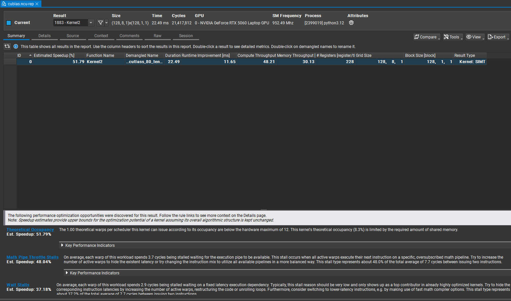
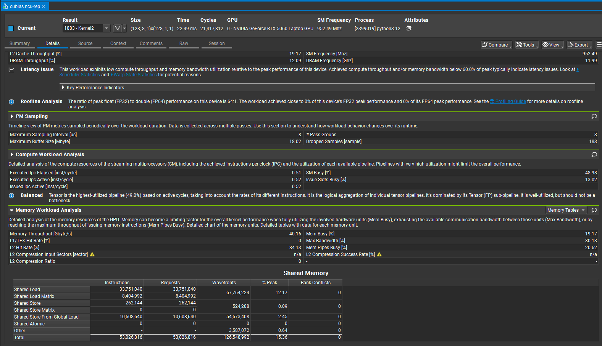
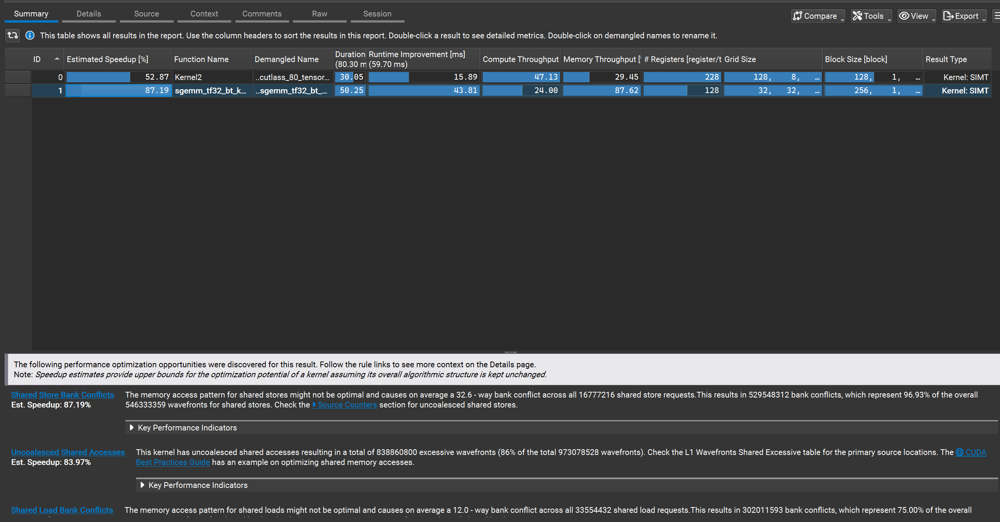
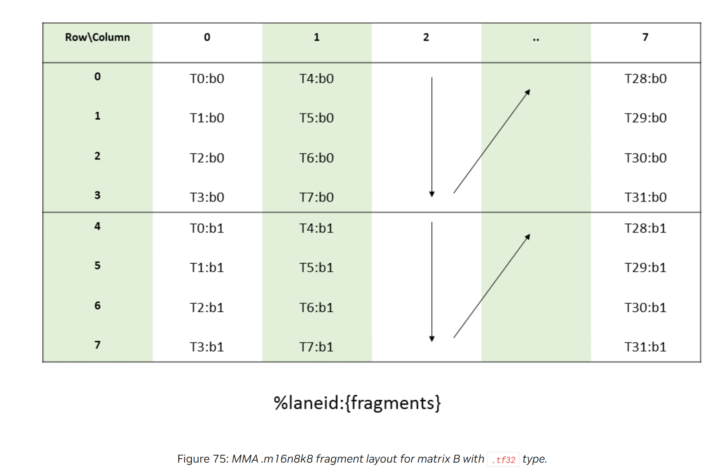

# [CUDA 优化实战] sgemm tf32 - 超越 cuBLAS：Tensor-core、cp.async、ldmatrix、mma

## 0. 序 - 向量化计算的时代

（干货核能预警，配图较多，涉及大量地址坐标映射推导代码，建议在 PC 端阅读以获得最佳体验）
（本文适用于有一定 CUDA 编程基础，熟悉 GEMM simt 优化，对进阶 tensor core / 嵌入 PTX 指令 性能调优感兴趣的读者阅读）
（所有 kernel 完整代码可以从 github 获取，欢迎大家关注我的手撕算子系列 vitmin-cuda 项目：）
>
> 怎么感觉要写出超越 cuBLAS 系列合集呢
>
在如今 Tensor Core 满天飞的时代，要是你还不知道怎么用 Tensor Core 进行 GEMM 计算，那你可能已经落后于时代了。

本文以 M=N=K=4096（MxKxN, 这是 cuBLAS 最擅长的中等规模）的 GEMM tf32 为例，在 RTX 5060 移动版显卡上，本人将使用 cp.async、ldmatrix、mma 等 PTX 指令，使用 Tensor-Core TF32 加速  计算，在同精度赛道上成功超越了 NVIDIA 原厂的 cuBLAS。本文将复盘这场与 cuBLAS 较量（真较量，ncu 一步一步 profile+迭代优化）过程。细节会具体到 cp.async 指令的运用，ldmatrix/mma warp 级别 PTX 指令，

本文会给出 5 个 kernel 实现，从基础的 cp.async + 双 ldmatrix + mma，到 swizzle 解决 bank conflict，分析 ldmatrix/mma 的 b fragments layout 从而直接使用 shared load 更进一步解决 bank conflict，使用 grid swizzling 复用 L2，double buffer 隐藏时延 等手段完成最终对 cuBLAS 的超越。整个过程涉及对指令需求用法的介绍和分析，精巧的 swizzle 设计，隐藏时延的哲学，希望能帮助读者深入理解 Tensor Core 的使用和优化技巧。

和之前 sgemm simt kernel 相比，本人是先有的优化路径然后写代码，但由于本人对 tensor core 也并不熟悉，这一次是 ncu profile 驱动型演进。并且我先 profile 了 cuBLAS 的实现，从他的 kernel 名字和 shared memory table 逆推+参考其优化策略，最终实现了性能超越。（本人有合理理由怀疑 cuBLAS 应该是很久未更新，或者说未针对消费级显卡进行优化，因为本人在还有优化策略没全部用上的时候就已经匹配上了 cuBLAS 的性能）

kernel 大纲如下（第一个是 cublas kernel）

- sgemm_cublas tf32 版
- sgemm_tf32_bt（向量化读 A/B，B 转置写入 smem, ldmatrix + mma）
- sgemm_tf32_bt_swizzle （向量化读 A/B，B 转置写入 smem, ldmatrix + mma, As 0 冲突）
- sgemm_tf32_bt_swizzle_dbf （向量化读 A/B，B 转置写入 smem, ldmatrix + mma, As 0 冲突，grid swizzling, 97~102% cuBLAS 性能）
- sgemm_tf32_swizzle_bcf (cp.async 读写 A/B，swizzle， As/Bs 无冲突，grid swizzling)
- sgemm_tf32_swizzle_bcf_dbf (cp.async 读写 A/B，swizzle， As/Bs 无冲突，grid swizzling，双 buffer，超越 cuBLAS)

## 0x0. PTX 指令 && ncu profile cublas kernel

当我准备开始写 sgemm tf32 kernel 时，先去搜索了下 ldmatrix、mma 指令相关的博客文章想好好学一下。等大概翻了下发现，怎么都是讲的半精度的 GEMM（倒也合理，毕竟是 Tensor Core 最初就是为半精度设计的），但是难道大家从半精度开始学起的，就不管 tf32 了（我丢）。无奈，只好自己开始翻 nvidia 的 PTX 文档，以及先 profile 一下 cublas kernel 作为参考。

### PTX 指令

PTX（parallel-thread-execution）官方文档：<https://docs.nvidia.com/cuda/parallel-thread-execution/index.html>，是 nv 提供的虚拟汇编指令语法集。在本文中主要用到的指令有：cp.async、ldmatrix、mma，cp.async 是异步拷贝指令，ldmatrix/mma 是 warp 级别协同搬运计算指令。

具体讲解指令之前，先说明一下在 C++ (CUDA) 代码中嵌入 PTX 汇编指令的语法结构。它使用的是 GCC 扩展内联汇编（Extended Asm）语法，一般为：

```c++
asm volatile(
    "汇编指令模板；"
    : 逗号分隔的输出操作数   /* 可选 */
    : 逗号分隔的输入操作数   /* 可选 */
    : 破坏描述符 (Clobbers) /* 可选 */
);
```

比如我们即将用的到 cp.async:

```cpp
asm volatile("cp.async.cg.shared.global.L2::128B [%0], [%1], 16;\n" ::"r"(dst_smem_32b), "l"(src_global_ptr))
```

核心关键字解析：

- asm：内联汇编的关键字，告诉编译器这里开始是一段汇编代码。
- volatile：告诉编译器不要对这段代码进行优化（比如不要随意改变执行顺序，或者认为没有使用其输出就将其删除）。这对异步拷贝、矩阵乘法等涉及底层硬件调度的指令至关重要。

标点与占位符解析：

- %0, %1：这些是汇编字符串里的占位符。编译器会按照下面输出和输入操作数列表的顺序，从 0 开始依次将 C++ 变量映射到这些占位符上。
- 换行符 \n：有些指令末尾会带有 \n。这纯粹是为了排版。当编译器把 C++ 编译成 .ptx 汇编文件时，加了 \n 能保证生成的汇编代码优雅地换行。
- 冒号 : 与 :: 用法：冒号用于分隔汇编代码、输出、输入等部分。如果一条指令只有输入，没有输出，为了让编译器知道后面的参数是输入，就必须用两个冒号 :: 跳过输出部分。
- 破坏描述符是开发者主动告诉编译器，该汇编指令会影响特定的物理寄存器、系统内存 ("memory") 或状态标志位中的值，以此强制编译器放弃对这些资源的旧缓存，重新读取，从而避免后续复用时出现严重的逻辑错误。

约束字符 (Constraints)，在绑定 C++ 变量和汇编操作数时，我们需要用字符串（如 "r", "=f"）告诉编译器该如何分配寄存器：

- = （修饰符）：表示“只写”，通常用于输出操作数。如果不带 =，则默认是“只读”，用于输入操作数。
- r (Register)：表示将变量放入一个 32 位的通用整数寄存器中。
- l (Long)：表示 64 位寄存器（在 CUDA 中通常用来存储 64 位全局内存指针，比如 src_global_ptr）。
- f (Float)：表示 32 位浮点寄存器。
- "=r"：将结果输出到一个 32 位通用寄存器。
- "r"：从一个 32 位通用寄存器中读取输入。
- "=f","f": 同理

好了，下面介绍下我们即将用到的指令，只说我们用到的具体用法，免得太枯燥冗长，各指令其他用法还是请参考官方文档：

```cpp

cp.async.cg.shared.global.L2::128B [%0], [%1], 16; // cg： (Cache at Global level)：bypass L1，拷贝 16 字节
cp.async.commit_group;  // 提交异步拷贝任务

cp.async.wait_group 0;  // 表示允许当前线程后台异步的 group 数，0 表示不允许后台，要等待到全部完成
```

- cp.async：异步拷贝指令，支持 bypass L1/register， 从 gmem 到 L2 直达 smem，节省大量寄存器资源，并且异步性非常适合与计算重叠作为多级流水线实现的基础

```cpp
mma.sync.aligned.m16n8k4.row.col.f32.tf32.tf32.f32        d, a, b, c;
```

- mma：介绍 ldmatrix 之前要先说 mma，因为 ldmatrix 就是为 mma 服务的
  - 根据官方文档，我们这个后天加入的 tf32 计算，只支持 shape m16n8k8 计算，A 为行优先矩阵，B 为列优先矩阵
  - shape 定了后，输入的 fragment A,B,C（后面会详细说）的 shape 和 下标值也确定了
  - 总之，mma 是有一点死板（个人感觉）

```cpp
ldmatrix.sync.aligned.m8n8.x4.shared.b16 {%0, %1, %2, %3}, [%4]; //协同加载 4 个 8x8 矩阵，每个线程最终 hold 4 个值
ldmatrix.sync.aligned.m8n8.x2.shared.b16 {%0, %1}, [%2]; //协同加载 2 个 8x8 矩阵，每个线程最终 hold 2 个值
```

- ldmatrix：一个 warp 从 smem 协同加载一个小矩阵分块到所有线程，所有线程一起 hold 着的寄存器结果叫做一个 fragment （死板+1）
  - 注意 x2，x4，表示读取线程数为 16，32。ldmatrix 读取数据，提供地址的每个线程永远是读 16 字节！读取完后会分发到各个线程，组成一个 fragment。（理解这一点，才能理解如何解决 bank conflict）
  - 由于 tf32 mma 只支持 m16n8k8，为了加载 16x8 的 A 和 8x8 的 B 矩阵，所以我们只能用 m8n8 shape + .b16 去搬运 32bit 的数据
  - 同样由于 tf32，我们也无法使用 trans 转置（这也是个坑，手动转置和尝试寄存器 shuffle 转置折腾了我很久）

### cuBLAS kernel ncu report




说实话，第一眼看到 cuBLAS 的 ncu report 时，我是有点发虚的。充分的算力访存比，完美的 shared memory table 结果，它使用了 cp.async，ldmatrix，shared load，但是 0 个 shared memory bank conflict，全合并的 global memory 访问。看起来似乎没有优化空间了，这如何赶上它的性能啊。所以最初想着能达到 95% 性能以上就差不多了。

再看一眼 kernel 名字，调用的 cutlass kernel `void cutlass::Kernel2<cutlass_80_tensorop_s1688gemm_64x256_16x4_nn_align4>(T1::Params)`, 嗯，tensor core mma m16n8k8，64x256 的 tiling（m=64，n=256），16 的 k 维度切块，4 级流水线。

ok, 初步摸清对手底细了，开始手搓我们自己的 kernel。

## 0x1. sgemm_tf32_bt

这个初版 kernel，我的想法很简单，就是把 cp.async 用上，ldmatrix + mma 启动起来，就算完事。其他 bank conflict，合并访存什么的就先不管了。当然，也没有那么粗暴。虽然大概猜出 cublas 的 cutlass 的实现，但是我并不想照抄他的。抄，抄还能超得过师傅吗，何况逆推的策略也不一定完整，起码 4 级流水线我就不想写（要改 smem 大小），然后 4 个 stage 的调度，我表示放弃。

我还是按着我原来 SIMT kernel 的思路

- 128x128 的 tiling（c矩阵视角），k跨步为16
- 256 的 thread block（tiling size 选择的策略很许多考量因素，详细情况见我上一篇文章）
- 同时做了一个 2d 的 2x4 warp tiling，划分为 64x128 上下两半的 c 分块，一个 warp 负责 64x32，对应 mma 的 16x8x8，正好64/16=4，32/8=4，4x4轮（k维度累加另算），完美（我就是喜欢正方形，对称就是好）。
然后整个流程也没有太多要点：
- As 矩阵用 cp.async 从 global memory bypass L1 直达 smem，Bs 矩阵用 LDG + 手动转置写入 smem
- 然后用 ldmatrix 加载 As，Bs 到寄存器， mma 计算，
- 得到 c fragment，写回 c。
唯一要提一下的是，mma 的结果 fragment c 的布局（就是每个线程 hold 哪些值），不然你都不知道怎么映射回全局坐标，这个具体见：<https://docs.nvidia.com/cuda/parallel-thread-execution/index.html#warp-level-matrix-fragment-mma-1688>

```cpp
// a block calculate c[128][128]
template <const int BM = 128, const int BN = 128, const int BK = 16>
__global__ __launch_bounds__(256, 2) void sgemm_tf32_bt_kernel(float *a, float *b, float *c, int m, int n, int k) {
    int bx = blockIdx.x, by = blockIdx.y;
    int tid = threadIdx.x; // 0~255
    int warp_id = tid / WARP_SIZE;
    int lane_id = tid % WARP_SIZE;

    // 搬运映射
    int load_a_row = tid / 4;               // 0~63
    int load_a_col = (tid % 4) * 4;         // 0,4,8,12
    int load_b_row = tid / WARP_SIZE;       // 0~7  (K 维度）
    int load_b_col = (tid % WARP_SIZE) * 4; // 0~124 (N 维度）

    // A 保持 行优先，B 转置为 列优先
    __shared__ float As[BM][BK];
    __shared__ float Bs[BN][BK];

    // 2x4 warp tiling
    // 一行 warp 负责上下 64x128， 每个 warp 负责  64 x 32 的 C 矩阵块
    int warp_id_m = warp_id / 4; // 0, 1
    int warp_id_n = warp_id % 4; // 0, 1, 2, 3

    // 寄存器总量：M 维 4 块 * N 维 4 块 * 每块 4 个寄存器 = 64 个浮点寄存器/线程
    float sum[4][4][4] = {0.f};

    // 主循环
    for (int bk = 0; bk < k; bk += BK) {

        // 1. 使用 cp.async 加载 A 矩阵 (16 bytes 对齐）
        uint32_t smem_a0 = static_cast<uint32_t>(__cvta_generic_to_shared(&As[load_a_row][load_a_col]));
        uint32_t smem_a1 = static_cast<uint32_t>(__cvta_generic_to_shared(&As[load_a_row + 64][load_a_col]));

        float *global_a0 = &a[(by * BM + load_a_row) * k + bk + load_a_col];
        float *global_a1 = &a[(by * BM + load_a_row + 64) * k + bk + load_a_col];

        CP_ASYNC_CG(smem_a0, global_a0);
        CP_ASYNC_CG(smem_a1, global_a1);
        // 提交所有的异步拷贝任务
        CP_ASYNC_COMMIT_GROUP();

        // 2. 加载 B 矩阵并手动转置写入 smem
        float4 tmp_b0 = FLOAT4(b[(bk + load_b_row) * n + bx * BN + load_b_col]);
        float4 tmp_b1 = FLOAT4(b[(bk + load_b_row + 8) * n + bx * BN + load_b_col]);

        // 将读取的 B 手动转置写入 smem
        Bs[load_b_col + 0][load_b_row] = tmp_b0.x;
        Bs[load_b_col + 1][load_b_row] = tmp_b0.y;
        Bs[load_b_col + 2][load_b_row] = tmp_b0.z;
        Bs[load_b_col + 3][load_b_row] = tmp_b0.w;
        Bs[load_b_col + 0][load_b_row + 8] = tmp_b1.x;
        Bs[load_b_col + 1][load_b_row + 8] = tmp_b1.y;
        Bs[load_b_col + 2][load_b_row + 8] = tmp_b1.z;
        Bs[load_b_col + 3][load_b_row + 8] = tmp_b1.w;

        CP_ASYNC_WAIT_GROUP_0();
        __syncthreads();

        // 3. Tensor Core 计算阶段 (K 维度走 2 步，每次消耗 8 个 K)
#pragma unroll
        for (int k_step = 0; k_step < 2; ++k_step) {
            int k_offset = k_step * 8;

            uint32_t reg_a[4][4];
            uint32_t reg_b[4][2];

            // 发射 4 次 ldmatrix 获取 A 矩阵块 (4 * 16 = 64 行）
#pragma unroll
            for (int m_idx = 0; m_idx < 4; ++m_idx) {
                // warp_id_m 跨度是 64
                int a_row = warp_id_m * 64 + m_idx * 16 + (lane_id % 16);
                int a_col = k_offset + (lane_id / 16) * 4;
                uint32_t smem_addr = static_cast<uint32_t>(__cvta_generic_to_shared(&As[a_row][a_col]));
                LDMATRIX_X4(reg_a[m_idx][0], reg_a[m_idx][1], reg_a[m_idx][2], reg_a[m_idx][3], smem_addr);
            }

            // 发射 4 次 ldmatrix 获取 B 矩阵块 (4 * 8 = 32 列）
#pragma unroll
            for (int n_idx = 0; n_idx < 4; ++n_idx) {
                // warp_id_n 跨度是 32
                int b_row = warp_id_n * 32 + n_idx * 8 + (lane_id % 8);
                int b_col = k_offset + ((lane_id / 8) % 2) * 4;
                uint32_t smem_addr = static_cast<uint32_t>(__cvta_generic_to_shared(&Bs[b_row][b_col]));
                LDMATRIX_X2(reg_b[n_idx][0], reg_b[n_idx][1], smem_addr);
            }

            // MMA 核心运算：4x4 的 1688
#pragma unroll
            for (int m_idx = 0; m_idx < 4; ++m_idx) {
#pragma unroll
                for (int n_idx = 0; n_idx < 4; ++n_idx) {
                    M16N8K8(sum[m_idx][n_idx][0],
                            sum[m_idx][n_idx][1],
                            sum[m_idx][n_idx][2],
                            sum[m_idx][n_idx][3],
                            reg_a[m_idx][0],
                            reg_a[m_idx][1],
                            reg_a[m_idx][2],
                            reg_a[m_idx][3],
                            reg_b[n_idx][0],
                            reg_b[n_idx][1]);
                }
            }
        }
        __syncthreads();
    }

    // Tensor Core m16n8k8 C 寄存器碎片的标准排布映射法则
    // c fragments layout:
    // https://docs.nvidia.com/cuda/parallel-thread-execution/index.html#warp-level-matrix-fragment-mma-1688 1688.tf32
    int t_row = lane_id / 4;       // 0~7
    int t_col = (lane_id % 4) * 2; // 0, 2, 4, 6

#pragma unroll
    for (int m_idx = 0; m_idx < 4; ++m_idx) {
#pragma unroll
        for (int n_idx = 0; n_idx < 4; ++n_idx) {
            // 根据新的 Warp 跨度重新计算 Global C 的基址
            int c_base_row = by * BM + warp_id_m * 64 + m_idx * 16;
            int c_base_col = bx * BN + warp_id_n * 32 + n_idx * 8;

            c[(c_base_row + t_row) * n + c_base_col + t_col] = sum[m_idx][n_idx][0];
            c[(c_base_row + t_row) * n + c_base_col + t_col + 1] = sum[m_idx][n_idx][1];
            c[(c_base_row + t_row + 8) * n + c_base_col + t_col] = sum[m_idx][n_idx][2];
            c[(c_base_row + t_row + 8) * n + c_base_col + t_col + 1] = sum[m_idx][n_idx][3];
        }
    }
}
```

跑个 benchmark 看一下：

```yaml
n: 4096, m: 4096, k: 4096
torch                                    mean time: 15.146454 ms, 9.07 tflops
sgemm_cublas_tf32                        mean time: 8.535476 ms, speedup: 1.77, tflops: 16.10
sgemm_tf32_bt                            mean time: 15.925327 ms, speedup: 0.95, tflops: 8.63
```

我去，惨不忍睹啊，比 pytorch 的 fp32 矩阵乘法还要慢。ncu profile一下


醒目的bank conflicts比例，不过也是意料之中了。接下来优化smem访问

## 3. sgemm_tf32_bt_swizzle

### As优化

先说一下，数据是如何搬运到As，以及ldmatrix是如何访问As的。128x16行数据，cp.async部分可以先忽略，因为就类似于我们之前平铺线程float4向量化访问（区别在于这里我们bypass了L1和寄存器）
重点下需要理解一下ldmatrix load A fragment的过程。通过阅读官方文档，我总结一下
一个 warp 执行 ldmatrix 有两个阶段

- 指定的读取线程从对应的地址读取16字节数据（x1，x2，x4，指定的线程数分别为前8，16，32个线程）
- 读取完的数据划分给32个线程
这里我们warping tiling 划分得比较好，正好可以用ldmatrix x4，即32个线程读取16x8个数据。

```cpp
int a_row = warp_id_m * 64 + m_idx * 16 + (lane_id % 16);
int a_col = k_offset + (lane_id / 16) * 4;
```

从As读取16x8的矩阵，我们给了16行2列共32个地址（每个地址是连续16字节数据的首地址，两列之间相距 16 字节，意思是16行连续的8个float），计算一下每个线程读取的地址：(以warp0为例)

```yaml
row:0, 1, 2, 3, 4, 5, 6, 7, 8, 9, 10, 11, 12, 13, 14, 15, 0, 1, 2, 3, 4, 5, 6, 7, 8, 9, 10, 11, 12, 13, 14, 15
col:0, 0, 0, 0, 0, 0, 0, 0, 0, 0, 0, 0, 0, 0, 0, 0, 4, 4, 4, 4, 4, 4, 4, 4, 4, 4, 4, 4, 4, 4, 4, 4
```

As是128x16 float的布局，也就是说每两行是一组32个bank。这里前后32个线程其中有16个线程都在访问相同bank的不同地址，惨烈的16-way bank conflict.

好，根据我们的习惯，开始推导swizzle公式:
row是二进制 00000~01111(0xxxx)
col只有两种，00000 和 00100

而cp.async是16字节（即float4）对齐，即我们不能扰动col的低2bit。

由此，我们得到了一个As读写无冲突版的swizzle公式: `new_col = col ^ (((row >> 1) & 0x3) << 2)`

### Bs优化

从global memory写入到Bs[128][16]，由于我们的转置操作。

```cpp
int load_b_row = tid / WARP_SIZE;       // 0~7  (K维度)
int load_b_col = (tid % WARP_SIZE) * 4; // 0~124 (N维度)
```

实际每个线程写入地址为：（以warp 0为例）

```yaml
row:0, 1, 2, 3, 4, 5, 6, 7, 0, 1, 2, 3, 4, 5, 6, 7, 0, 1, 2, 3, 4, 5, 6, 7, 0, 1, 2, 3, 4, 5, 6, 7
col:0, 0, 0, 0, 0, 0, 0, 0, 4, 4, 4, 4, 4, 4, 4, 4, 0, 0, 0, 0, 0, 0, 0, 0, 4, 4, 4, 4, 4, 4, 4, 4
```

此外，从Bs ldmatrix x2 读取 8x8 的矩阵，我们给了8行2列共16个地址（类似As，8行连续的8个float）

```cpp
int b_row = warp_id_n * 32 + n_idx * 8 + (lane_id % 8);
int b_col = k_offset + ((lane_id / 8) % 2) * 4;
```

计算一下每个线程读取的地址：(以warp0为例， 可以只看前16线程，后半16线程不直接读取smem)

```yaml
row:0, 1, 2, 3, 4, 5, 6, 7, 0, 1, 2, 3, 4, 5, 6, 7
col:0, 0, 0, 0, 0, 0, 0, 0, 4, 4, 4, 4, 4, 4, 4, 4
```

8-way bank conflict.

根据As的优化经验，我们同样对Bs的写入进行swizzle优化：`new_col = col ^ ((((row) >> 2) & 0x3) << 2)`

核心修改在于As/Bs读写加上swizzle：

跑一下benchmark：

```bash
n: 4096, m: 4096, k: 4096
torch                                    mean time: 15.146454 ms, 9.07 tflops
sgemm_cublas_tf32                        mean time: 8.535476 ms, speedup: 1.77, tflops: 16.10
sgemm_tf32_bt                            mean time: 15.925327 ms, speedup: 0.95, tflops: 8.63
sgemm_tf32_bt_swizzle                    mean time: 9.786451 ms, speedup: 1.55, tflops: 14.04
```

嗯，有很大进步，还差1ms多就接近 cuBLAS 了。

## 4. sgemm_tf32_bt_swizzle_dbf

通过之前的修改，我们做到了无 bank conflict 的 As 读写，Bs读写冲突也有一定下降。一时想不到办法，我听传闻说ldmatrix走的是不同的硬件电路，和ldg不同。所以我死马当作活马医，先上双buffer流水线看一下。流水线流程参考我的上一篇文章，具体代码也不贴了。直接跑一下benchmark：

```bash
n: 4096, m: 4096, k: 4096
torch                                    mean time: 15.146454 ms, 9.07 tflops
sgemm_cublas_tf32                        mean time: 8.535476 ms, speedup: 1.77, tflops: 16.10
sgemm_tf32_bt                            mean time: 15.925327 ms, speedup: 0.95, tflops: 8.63
sgemm_tf32_bt_swizzle                    mean time: 9.786451 ms, speedup: 1.55, tflops: 14.04
sgemm_tf32_bt_swizzle_dbf                mean time: 9.025055 ms, speedup: 1.68, tflops: 15.23
```

更接近了，还差0.xms。但还能怎么办，仔细看ncu报告，我发现cuBLAS的L2 cache命中极高（85%+），我只有（30%+）。

### grid swizzling

这里是不是 L2 cache起的作用，试试就知道，上技巧 grid swizzle。grid swizzle的意思就是把block访问global memory的顺序重新排列一下。默认情况下cuda是按照grid的x，y维度顺序发射的。我们手动调整一下block访问的实际分块。每8个一组。

```cpp
    // grid swizzling
    int linear_id = blockIdx.y * gridDim.x + blockIdx.x;
    const int SWIZZLE_W = 8; // 将执行块设置为 8 的宽度

    int bx = (linear_id % SWIZZLE_W) + (linear_id / (SWIZZLE_W * gridDim.y)) * SWIZZLE_W;
    int by = (linear_id / SWIZZLE_W) % gridDim.y;
```

这样，相邻发射的block（极短的时间窗口内），访问A/B矩阵的block，其实是复用到A的行块，B的列块，这部分还在L2 cache中，不需要从global memory读取。跑一下benchmark：

```bash
n: 4096, m: 4096, k: 4096
torch                                    mean time: 15.146454 ms, 9.07 tflops
sgemm_cublas_tf32                        mean time: 8.535476 ms, speedup: 1.77, tflops: 16.10
sgemm_tf32_bt                            mean time: 15.925327 ms, speedup: 0.95, tflops: 8.63
sgemm_tf32_bt_swizzle                    mean time: 9.786451 ms, speedup: 1.55, tflops: 14.04
sgemm_tf32_bt_swizzle_dbf                mean time: 8.723189 ms, speedup: 1.83, tflops: 15.76
```

果然有作用，时延更更更接近了，ncu report中我们L2 cache命中率提升到了90%+。可惜，还差一点点。

## 5. sgemm_tf32_swizzle_bcf

就还差一点点了，怎么办，swizzle，double buffer，grid swizzle都用上了。我重新翻开cuBLAS的ncu profile进行对比。仔细观察，苦思冥想，最大区别在哪？cuBLAS 0 bank conflict，我1.6亿次冲突。没理由cuBLAS能做到0冲突，我们做不到呀。cuBLAS怎么做到的呢？通过分析对比shared memory table，我发现：
cuBLAS的ldmatrix指令数比我少很多，多了很多shared load指令，cp.async指令也比我多，ldg指令为0。说明了什么，说明cuBLAS读取global memory全用的cp.async，而有部分smem读取没有用ldmatrix指令，显然，就是Bs矩阵的读取使用了常规的shared load方法。

既然逆推出了cuBLAS的Bs读取策略，我们把Bs ldg改成cp.async，同时尝试把ldmatrix换成常规的shared load。这一步没有那么轻松，我们要理解ldmatrix后b fragment的详细状态，才能用直接读取smem的方式替换ldmatrix，否则无法使用mma指令。通过查看官方文档，


仔细理解一下 m16n8k8 tf32 下b fragment的寄存器排布。如图，其中b0，b1表示每个线程的两个32位寄存器。load一个8x8的矩阵后，其实是每四个线程拿着一列数据，T0拿着的是b[0][0],b[4][0]， T1拿着的是b[1][0],b[5][0]... T4拿着的是[0][1],[4][1]...

这么一看，也不是很复杂，完全可以从global memory读取数据原原本本放进Bs，然后手动进行坐标映射去读取Bs。
核心修改，就是使用cp.async从global memory读取数据写入Bs，然后直接读取smem进行坐标映射。

```cpp

```

结果：

```yaml
n: 4096, m: 4096, k: 4096
torch                                    mean time: 15.146454 ms, 9.07 tflops
sgemm_cublas_tf32                        mean time: 8.535476 ms, speedup: 1.77, tflops: 16.10
sgemm_tf32_bt                            mean time: 15.925327 ms, speedup: 0.95, tflops: 8.63
sgemm_tf32_bt_swizzle                    mean time: 9.786451 ms, speedup: 1.55, tflops: 14.04
sgemm_tf32_bt_swizzle_dbf                mean time: 8.723189 ms, speedup: 1.83, tflops: 15.76
sgemm_tf32_swizzle_bcf                   mean time: 8.402071 ms, speedup: 1.89, tflops: 16.36
```

## 6. sgemm_tf32_swizzle_bcf_dbf

好，再给我们的无冲突版加上 double buffer 流水线优化，就是完全版的优化kenel。跑一下benchmark

```bash
n: 4096, m: 4096, k: 4096
torch                                    mean time: 15.146454 ms, 9.07 tflops
sgemm_cublas_tf32                        mean time: 8.535476 ms, speedup: 1.77, tflops: 16.10
sgemm_tf32_bt                            mean time: 15.925327 ms, speedup: 0.95, tflops: 8.63
sgemm_tf32_bt_swizzle                    mean time: 9.786451 ms, speedup: 1.55, tflops: 14.04
sgemm_tf32_bt_swizzle_dbf                mean time: 8.723189 ms, speedup: 1.83, tflops: 15.76
sgemm_tf32_swizzle_bcf                   mean time: 8.402071 ms, speedup: 1.89, tflops: 16.36
sgemm_tf32_swizzle_bcf_dbf               mean time: 8.275736 ms, speedup: 1.92, tflops: 16.61
```

从 15.925327 到 8.275736，又是一次纯手搓的性能优化，正面硬刚并超越 cuBLAS ！这个过程中，我们通过精确地资源分配，结合 ldmatrix/mma 而设计的复杂精巧 (a,b,c 各不相同）的搬运/计算坐标映射，block 重排拉满 L2 利用率，加上双 buffer 流水线技术，实现了超越 cuBLAS 的性能。很有成就感，对不对！

## 8. 一些讨论

- 我们的终版 kernel 确实已经稳定超过 cuBLAS（绝对值波动，但都比cuBLAS快），还有优化空间吗？当然是有的。比如，由于 mma 死板的 c fragment 输出，在写回 c 矩阵时，没有做到完美的事物合并。
  - 这里可以用 As/Bs smem 作为中转 buffer，先在 smem 中排整齐，再合并写入到 global memory。但是我暂时不想写了，经历上面的过程，理解 ldmatrix/mma，以及 fragment 排布，各种映射，swizzling，我的脑子快要发烧了。读写一次smem，又要考虑冲突问题，算了，既然性能超过 cuBLAS 就先缓缓吧~
- callback 一下开头，为什么 cuBLAS 的 0 冲突、4 级流水线、L2 拉满 的 kernel 性能还没我们两级流水线的性能好？
  - 我个人认为流水线是为了隐藏时延用的，并不是说越多级就越好，他为了调度安排 4 级流水线应该用了更多的寄存器资源（ncu 显示 228），只有一个 block 活跃
  - 我们的两级流水线，每个线程负责的计算量远比 cuBLAS 的 tiling 策略高，指令级并行度更高，而且有两个 block 活跃
  - 如果有 nv 的专家路过，可以留言讨论一下~
- 使用 mma tf32 的过程中，我一直有种别扭感，ldmatrix 没有 tf32 dtype，用不了 transpose
  - turing 引入的 tf32 tensor core 加速确实不完美，但经过这一番洗礼，后续写 hgemm 应该更顺畅了

## 总结

最后，相信经过这一轮下来，我们对 tensor core 的使用、warp 级协作、smem 的高效利用、以及如何通过 swizzling 和双 buffer 技术来优化性能都有了更深入的理解。

如有错误，请大家指正。完整 kernel 和测试代码可以从 github 获取，欢迎大家关注我的手撕算子系列 vitmin-cuda 项目：

最近一直在手搓 gemm，想先暂停一下，可能会更新AI infer的其他内容，比如 pytorch 分布式、llm推理之sglang 大规模部署 + L1 + L2 + L3 之类的？

以上。
